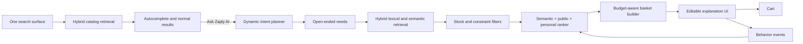
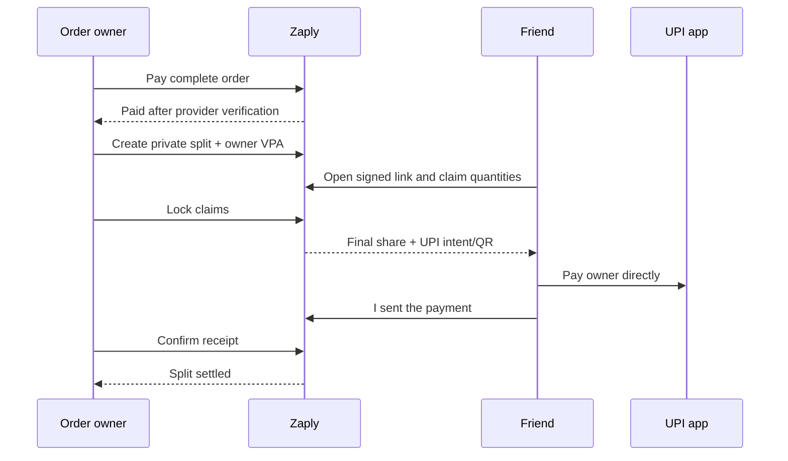

# Zaply architecture

## Request flow

The top search is the only query input. As the customer types, a low-latency hybrid ranker returns products using weighted name, prefix, brand, category and description matches, then blends popularity, availability and recent-cart affinity. Submitting the query opens normal catalog results. The AI action beneath autocomplete, and again beneath results, sends the same text to the planner only when a complete basket or recipe is wanted.

The query-understanding response has no intent, mission, occasion, recipe, or importance enum. Each requirement has free-form retrieval queries plus continuous `priority` and `confidence` scores. The catalog vocabulary is generated from current inventory, so adding a new department does not require a new code branch or taxonomy value. Retrieval still limits output to real in-stock products.

## Local MVP

- Next.js PWA for desktop and mobile web.
- Server-only `/api/recommend` route for model access and catalog grounding.
- Local TypeScript catalog with fictional inventory and prices plus all 81 GroceryStoreDataset classes.
- Browser-local cart and recent-item affinity.
- Local file-backed customer accounts with salted password hashes, signed HTTP-only sessions, persisted addresses and order history.
- OpenAI Responses API with strict JSON schema, or Ollama with the same schema.
- Normal product queries never call the model; the user explicitly promotes the same query to AI planning.
- Customer-triggered browser geolocation with a server-side reverse-geocoding boundary, a manual fallback, and account-address reuse. Only the resolved delivery label is retained in browser storage.
- File-backed payment, order, split, claim, participant, and settlement repositories behind server-only modules.
- A fake payment adapter with approved, pending, declined, and timeout states; an explicit unconfigured Amazon Pay adapter prevents accidental live use.
- Private seven-day split links store only a hash of the public secret. Guest participant secrets use HTTP-only cookies.
- Optimistic split versions and serialized writes reject concurrent over-claims with `409 Conflict`.
- Integer-paise proportional allocation uses largest-remainder rounding, with final reconciliation assigned to the owner.
- UPI intents and QR codes reimburse the order owner directly. Friends report payment and the owner confirms receipt.

## Post-order split flow

Public split responses include only sanitized line items, display names, claims, totals, and the participant's own settlement. They never expose account contact details, delivery addresses, payment credentials, or provider access tokens.

## AWS target mapping

| Local boundary | AWS production service |
| --- | --- |
| Next.js server route | API Gateway + Lambda or ECS/Fargate recommendation service |
| Catalog array | Aurora PostgreSQL + pgvector, fed by retailer inventory streams |
| Browser history | DynamoDB customer events and profile features |
| Local account and session adapter | Cognito user pools + DynamoDB/Aurora customer profile and order services |
| File-backed payment and split repositories | DynamoDB transactional order, split, claim, and settlement records |
| Serialized claim writes | DynamoDB conditional writes on split version |
| Local payment provider interface | Amazon Pay sandbox adapter with server-side capture and status reconciliation |
| Direct IPN route boundary | API Gateway verified webhook → SQS FIFO/idempotent consumer |
| Local domain transitions | EventBridge events plus notification consumers |
| Nominatim reverse-geocoding adapter | Amazon Location Service, or a managed/self-hosted geocoder with regional caching |
| Lexical retrieval | OpenSearch vector and keyword hybrid retrieval |
| Environment model adapter | Bedrock model invocation |
| In-memory/public scores | Kinesis events → S3/Glue → batch and streaming feature jobs |
| Local metrics page | CloudWatch metrics plus experiment dashboards |

At scale, intent plans and query embeddings are cached by normalized request and region. Retrieval happens per fulfillment store so price and stock are authoritative. A learning-to-rank model replaces hand-tuned weights after impression, click, add, removal, purchase, repeat purchase, return, and substitution data is large enough for unbiased training.
