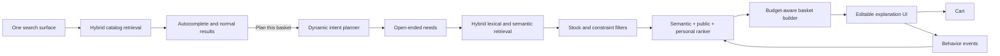

# Nesto architecture

## Request flow



The top search is the only query input. As the customer types, a low-latency hybrid ranker returns products using weighted name, prefix, brand, category and description matches, then blends popularity, availability and recent-cart affinity. Submitting the query opens normal catalog results. The AI action beneath autocomplete, and again beneath results, sends the same text to the planner only when a complete basket or recipe is wanted.

The query-understanding response has no intent, mission, occasion, recipe, or importance enum. Each requirement has free-form retrieval queries plus continuous `priority` and `confidence` scores. The catalog vocabulary is generated from current inventory, so adding a new department does not require a new code branch or taxonomy value. Retrieval still limits output to real in-stock products.

## Local MVP

- Next.js PWA for desktop and mobile web.
- Server-only `/api/recommend` route for model access and catalog grounding.
- Local TypeScript catalog with fictional inventory and prices plus all 81 GroceryStoreDataset classes.
- Browser-local cart and recent-item affinity.
- Local file-backed customer accounts with salted password hashes, signed HTTP-only sessions, persisted addresses and order history.
- Amazon Bedrock with the same open-ended JSON contract, or Ollama for zero-cost local inference.
- Normal product queries never call the model; the user explicitly promotes the same query to AI planning.
- Customer-triggered browser geolocation with a server-side reverse-geocoding boundary, a manual fallback, and account-address reuse. Only the resolved delivery label is retained in browser storage.
- File-backed payment, order, group-basket, claim, participant, and contribution repositories behind server-only modules.
- A fake payment adapter with approved, pending, declined, and timeout states; an explicit unconfigured Amazon Pay adapter prevents accidental live use.
- Private seven-day group links store only a hash of the public secret. Guest participant secrets use HTTP-only cookies.
- Optimistic group versions and serialized writes reject concurrent over-claims with `409 Conflict`.
- Integer-paise proportional allocation uses largest-remainder rounding, with final reconciliation assigned to the owner.
- Each participant links their own Amazon Pay account and authorizes a merchant charge for their portion. Real-provider linking uses the Amazon web SDK, a ten-minute one-time state, a server-side authorization-code exchange, and an encrypted token vault. Group records contain only an opaque authorization ID. The delivery order is created after every contribution is approved.
- Development-only fulfilment controls exercise the confirmed, packing, out-for-delivery, and delivered states. Production transitions arrive from signed warehouse and rider events rather than customer controls.

## Shared Amazon Pay checkout flow

```mermaid
sequenceDiagram
  participant O as Order owner
  participant P as Nesto
  participant F as Friend
  participant A as Amazon Pay
  O->>P: Create group basket from cart
  F->>P: Open signed link and choose quantities
  O->>P: Lock choices
  F->>A: Link account and authorize share
  A-->>P: Authorization code
  P->>A: Server token exchange
  P->>P: Encrypt tokens; attach opaque authorization ID
  A-->>P: Verified charge status
  O->>A: Authorize remaining share
  A-->>P: Verified charge status
  P->>P: Create one paid delivery order
  P-->>O: Order tracking begins
```

Public group responses include only sanitized line items, display names, claims, totals, link state, and the participant's own contribution. They never expose account contact details, delivery addresses, payment credentials, Amazon access tokens, or other participants' instruments.

For web and installed PWA clients, Amazon consent is loaded only after the customer chooses **Continue with Amazon Pay**. The callback state binds the authorization to one owner or participant and one group. Access and refresh tokens are encrypted with AES-256-GCM using a deployment secret; they are never stored inside the public group document. A native Android or iOS client can use Amazon's mobile SDK and PKCE while keeping the same callback, token-vault, contribution, and charge boundaries.

## AWS target mapping

| Local boundary | AWS production service |
| --- | --- |
| Next.js server route | API Gateway + Lambda or ECS/Fargate recommendation service |
| Catalog array | Aurora PostgreSQL + pgvector, fed by retailer inventory streams |
| Browser history | DynamoDB customer events and profile features |
| Local account and session adapter | Cognito user pools + DynamoDB/Aurora customer profile and order services |
| File-backed payment and group repositories | DynamoDB transactional order, group, claim, and contribution records |
| Serialized claim writes | DynamoDB conditional writes on group version |
| Local payment provider interface | Amazon Pay sandbox adapter with server-side capture and status reconciliation |
| Direct IPN route boundary | API Gateway verified webhook → SQS FIFO/idempotent consumer |
| Local domain transitions | EventBridge events plus notification consumers |
| Nominatim reverse-geocoding adapter | Amazon Location Service, or a managed/self-hosted geocoder with regional caching |
| Lexical retrieval | OpenSearch vector and keyword hybrid retrieval |
| Environment model adapter | Bedrock model invocation |
| In-memory/public scores | Kinesis events → S3/Glue → batch and streaming feature jobs |
| Local metrics page | CloudWatch metrics plus experiment dashboards |

The first deployable AWS slice is defined in `infra/aws/pico-foundation.yaml`. It uses scale-to-zero services and exposes a read-only `/health` endpoint. The web app exposes `/api/aws/status`, which reports whether all required CloudFormation outputs have been configured and checks that health endpoint without returning credentials. Local storage, fake payments, and the existing model provider stay active until each production adapter is explicitly enabled.

At scale, intent plans and query embeddings are cached by normalized request and region. Retrieval happens per fulfillment store so price and stock are authoritative. A learning-to-rank model replaces hand-tuned weights after impression, click, add, removal, purchase, repeat purchase, return, and substitution data is large enough for unbiased training.
